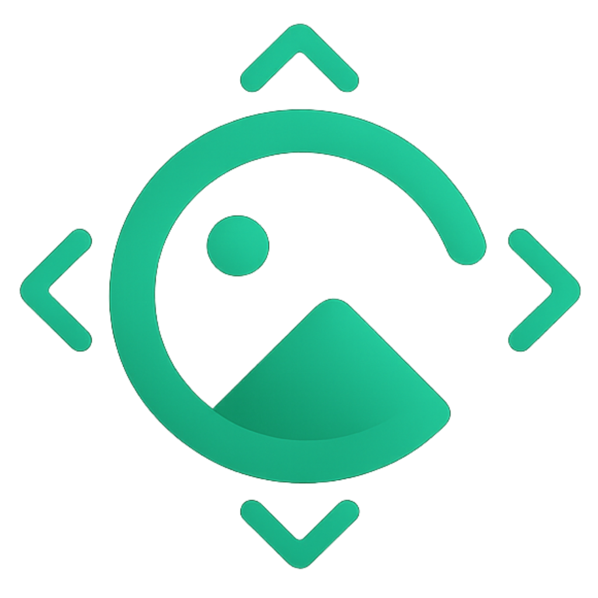

# Oraa AI

<p align="center"></p>

**Private, keyless perspective previews in your browser.** Upload a photo, adjust a small camera shift, and export a PNG. The default app runs entirely on the visitor's device. It needs no Hugging Face account, API key, Python server, or paid inference endpoint.

## What a preview can do

The free [Depth Anything V2 Small](https://github.com/DepthAnything/Depth-Anything-V2) model estimates relative depth. Oraa reprojects the original visible pixels with a depth buffer. It supports horizontal shifts of **−15° to +15°**, vertical shifts of **−10° to +10°**, and camera distance **0.85–1.15**.

This is a **depth-based perspective preview**, not generative image editing or a complete 3D reconstruction. It cannot invent a subject's unseen sides, produce back views, or recover occluded detail. Uncovered areas remain transparent in the exported PNG. Depth estimates can be imperfect, especially around thin objects and sharp boundaries.

## Run locally

Use Node.js 22 LTS (Vite requires at least Node 20.19 or 22.12).

```sh
npm ci --prefix frontend
npm run dev
```

Open the URL printed by Vite. Choose an image, adjust the camera, and click **Create Preview**. Fast uses up to 384px; Balanced uses up to 512px. Both preserve aspect ratio without enlarging small uploads. Depth is reused for subsequent camera changes on the same image at the same resolution.

First use downloads the public quantized model from Hugging Face and loads a bundled WASM runtime. Model files are cached through the browser Cache API when available. Later visits may require a download again if the browser evicts its cache. Internet access is needed for that initial download, but **no inference API is called and no image is uploaded**. This avoids the shared ZeroGPU quota entirely.

Inference uses single-threaded ONNX WASM in a Web Worker, so it does not require WebGPU or cross-origin isolation headers. **Cancel** terminates the worker. If the model cannot load, the worker fails, or depth processing exceeds 90 seconds, Oraa returns a clearly labelled **basic perspective preview** using a flat surface. This fallback has no AI depth and does not invent hidden details. Reload the page to retry model loading after a network failure. Invalid or oversized uploads still produce a useful validation message.

## Deploy on Vercel

1. Import [Madxfury/Oraa-AI](https://github.com/Madxfury/Oraa-AI).
2. Leave **Root Directory** at the repository root. The root `vercel.json` configures installation, build, static output, and SPA routing.
3. Use Node.js 22 and deploy. **No environment variables or backend deployment are needed.**

Alternatively, set Root Directory to `frontend`; its existing `vercel.json` supports that layout too. Remove old `VITE_BACKEND_URL` configuration: the default editor no longer calls a backend. Vercel serves static assets; the visitor's browser performs the computation. Initial download and inference speed depend on the visitor's connection and device.

Verify locally with the same static output:

```sh
npm run build
npm run preview
```

## Architecture and licenses

- React 19, TypeScript, Vite, Tailwind, Three.js / React Three Fiber.
- [`@huggingface/transformers`](https://github.com/huggingface/transformers.js) 3.8.1 (Apache-2.0) and ONNX Runtime Web (MIT).
- [`onnx-community/depth-anything-v2-small`](https://huggingface.co/onnx-community/depth-anything-v2-small), public quantized ONNX weights (Apache-2.0).
- Local image preparation, depth caching, reprojection with occlusion handling, transparent PNG export, and cancellable workers.

The library and WASM worker are bundled into the static build. Model weights are downloaded as public files, which is different from using a hosted inference API. Hugging Face file hosting can still be unavailable; the basic preview keeps the app usable in that case. The app does not promise that every browser, network, or malformed image is error-free.

## Checks

```sh
cd frontend
npm test
npm run lint
npm run build
```

Tests cover reprojection, transparent unknown regions, camera limits, model failure, depth reuse, cancellation, and upload validation. The older GPU adapter regression tests are retained separately.

## Legacy GPU backend

The `backend/`, `frontend/src/api.ts`, and Gradio helpers are retained for developers who need the previous generative Qwen workflow. They are **not used by the default browser editor**. That workflow depends on externally hosted GPUs, tokens or provider credentials, and service quotas; it cannot supply unlimited free generative inference on a static Vercel deployment.

For that optional backend, install `backend/requirements.txt`, copy `backend/.env.example` to `backend/.env`, configure the provider, and run `uvicorn main:app --port 8000` with one worker. The in-memory job queue is unsuitable for stateless Vercel Functions. Do not expose provider keys through `VITE_*` variables.

## Why the quota error needed a different approach

[Hugging Face ZeroGPU](https://huggingface.co/docs/hub/spaces-zerogpu) imposes daily GPU quotas. Removing a token or switching between public Spaces does not guarantee available inference. [Vercel supports the application layer rather than native GPU execution](https://vercel.com/i/what-is-serverless-gpu). Open-source weights do not include free unlimited GPU compute. Browser previews meet the free, keyless, static-hosting requirements by changing the feature to bounded image reprojection with explicit limits.

Oraa source is MIT licensed; third-party models and libraries retain their own licenses.
